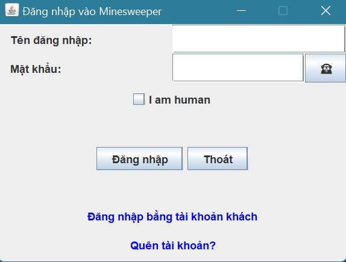
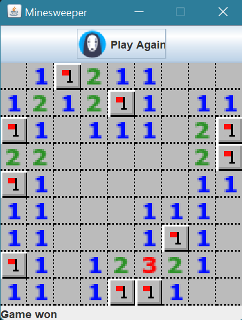

# Login2Minesweeper_Java

A Java-based login system integrated with a **Minesweeper** game, featuring CAPTCHA verification, OTP confirmation, score tracking, and leaderboard functionality.

## Screenshots

<table>
  <tr>
    <th style="text-align:center;">Login Screen</th>
    <th style="text-align:center;">Game Screen</th>
  </tr>
  <tr>
    <td style="text-align:center;">
      
    </td>
    <td style="text-align:center;">
      
    </td>
  </tr>
</table>

## Features

- **Login System**: Admin and guest logins with CAPTCHA and OTP security.
- **Minesweeper Game**: Play after login, with score saving.
- **Leaderboard**: Tracks top scores, highlighting the top 3 players.
- **Password Masking**: Hidden passwords, except for the current user.
- **Dynamic CAPTCHA**: CAPTCHA regeneration and validation.

## Project Structure

```
LoginSimulate/
├── src/       
│   ├── index.txt                    # Contains user information (username, password, email)   
│   └── Minesweeper/
|       ├── Code/
|       |   ├── Board.java
|       |   ├── Leaderboard.java
|       |   ├── Minesweeper.java
|       |   ├── ScoreEntry.java
|       |   └── Score.txt            # Save user scores
|       └── Pic/                     # Contains images used in the GUI
├── Account.java
├── LoginApp.java
└── LoginSelection.java
```

## Installation

1. **Download the ZIP file**: Clone the repository or download it as a ZIP file from GitHub.
   ```bash
   git clone https://github.com/Eggplant203/Login2Minesweeper_Java.git
   ```
   
3. **Extract the ZIP file**: If you downloaded the ZIP file, extract it to your desired location.

4. **Open in VS Code**: 
   - Launch Visual Studio Code.
   - Select **File** -> **Open Folder...**.
   - Choose the parent folder of `LoginSimulate` (e.g., `Login2Minesweeper_Java-master`).

5. **Run the Application**: 
   - In the sidebar **EXPLORER**, right-click on `LoginApp.java`.
   - Select **Run Java** to start the application.

## Usage

1. **Login**: Run `LoginApp.java`, use admin or guest login with CAPTCHA/OTP.  
   _Note: Three default accounts are pre-created. Check `src/index.txt` for usernames and passwords._
2. **Play Minesweeper**: Select the game after login. Scores are saved to `score.txt`.
3. **Leaderboard**: View top scores after completing the game.

## Reference
This project utilizes code from the [**Java Minesweeper Game**](https://github.com/janbodnar/Java-Minesweeper-Game) by janbodnar. The original Minesweeper game code has been adapted and integrated into the login system with additional features.
